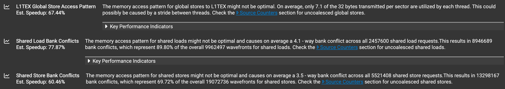

### WMMA FlashAttention-2 (Forward)

A re-implementation of FlashAttention-2 forward pass using Warp-level Matrix Multiply Accumulate (WMMA) API.

#### Problem Context

FlashAttention-2 relies on a row-wise maximum for numerical stability. However, when implemented using WMMA, entries are stored in opaque fragments which may not preserve row order. An additional IO operation to another container needs to be implemented to ensure correct row correspondance, which reduces efficiency. This kernel uses warp-level maximum to avoid the need for extra IO operations.

#### Design

- Warp-level maximum.
- Each block consists of a single-warp, operating on 16-rows of $Q$ with $d = 64$.

#### Performance
Benchmarked on NVIDIA T4 using cudaEventRecord

```bash
======================================================================
     N |          FA2 |         SDPA | Sanity Check
======================================================================
    64 |      0.046ms |      0.039ms | Truex
   128 |      0.089ms |      0.067ms | Truex
   256 |      0.231ms |      0.150ms | Truex
   512 |      0.846ms |      0.464ms | Truex
  1024 |      2.046ms |      1.107ms | Truex
  2048 |      4.512ms |      2.898ms | Truex
```
~64% of SDPA!🎉

#### Profiling & Bottlenecks

Nsight Compute analysis highlights several dominant performance bottlenecks:



- Uncoalesced Global Stores: on average only 7.1 out of 32 bytes are utilized.
- Shared Memory Bank Conflicts: on average 4.1-way bank conflict for load and 3.5-way bank conflict for store.

#### Future Work

- Implement strided access to global memory for coalesced storing and padding strategies to mitigate bank conflicts
- Explore optimum block size
- Compatibility with any head dimensions.

#### demo

run in colab <br>

```bash
!pip install ninja
!git clone https://github.com/zack041/wmma-flashattention-v2
%cd wmma-flashattention-v2
!python benchmark/benchmark.py
```
