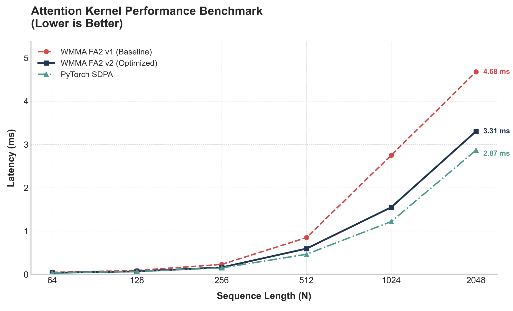
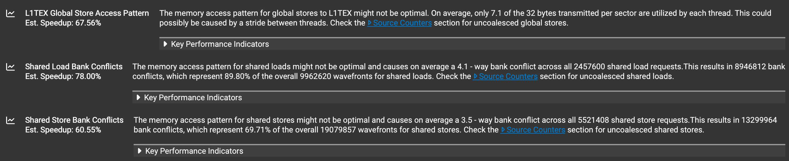
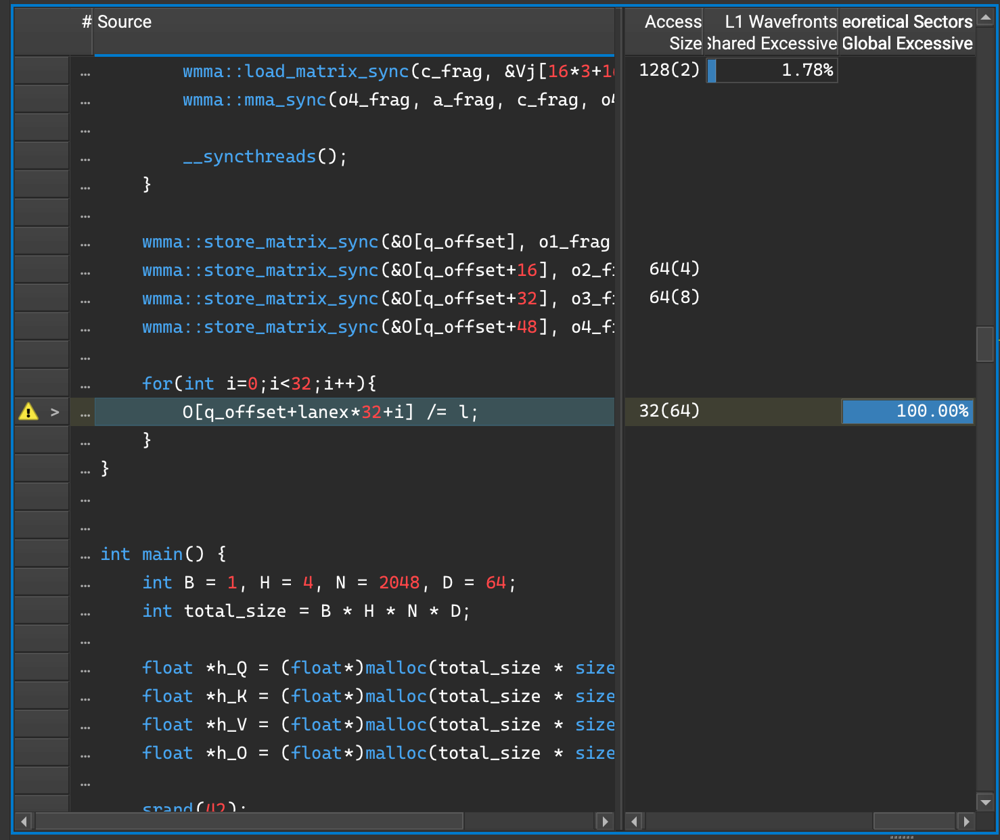
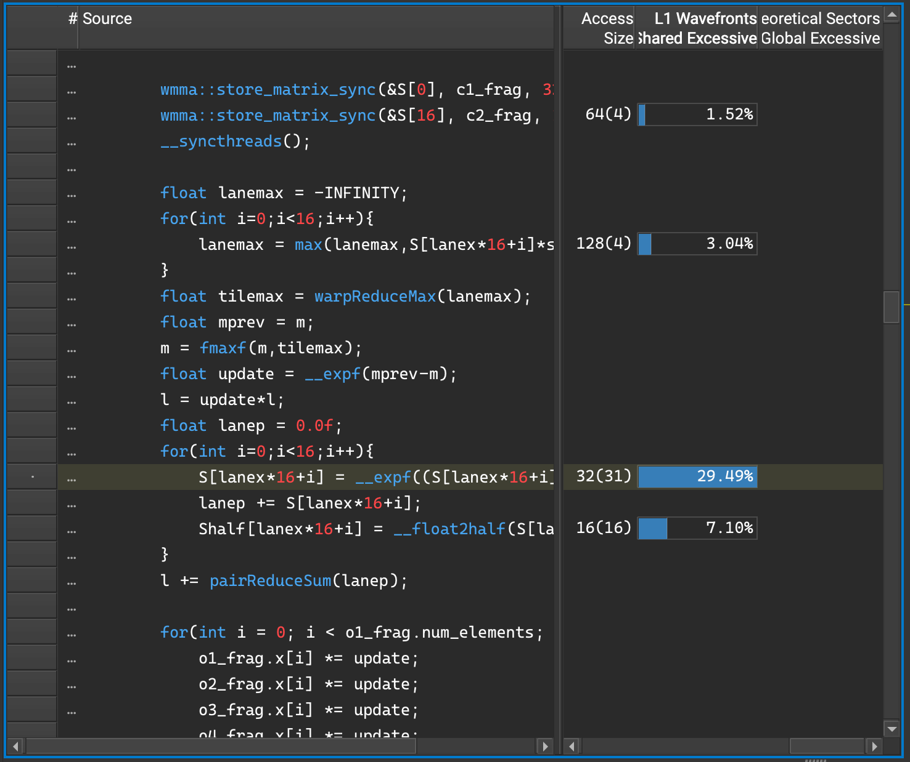
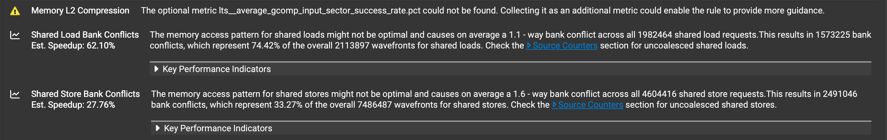
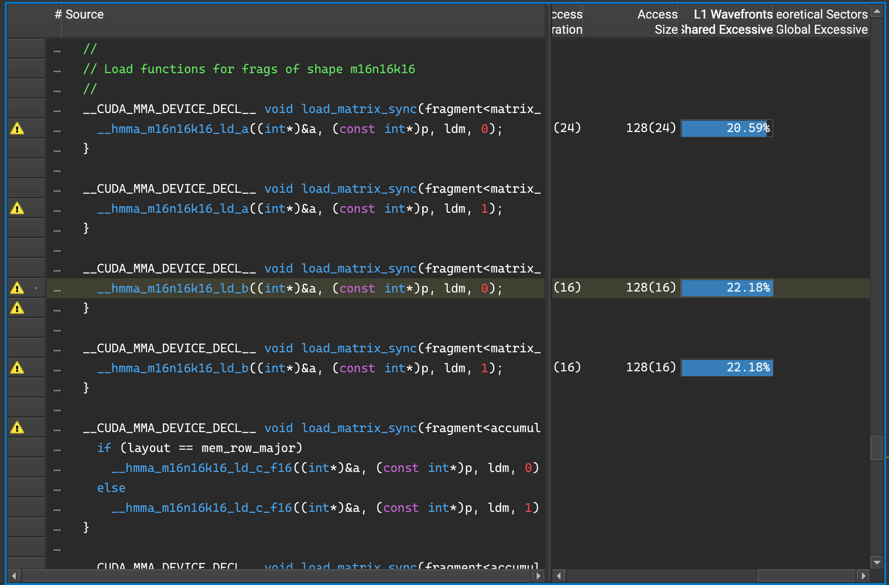

# WMMA FlashAttention-2 (Forward)

A re-implementation of FlashAttention-2 forward pass using Warp-level Matrix Multiply Accumulate (WMMA) API.

## Problem Context

FlashAttention-2 relies on a row-wise maximum for numerical stability. However, when implemented using WMMA, entries are stored in opaque fragments which does not preserve row order. An additional IO operation to another container needs to be implemented to ensure correct row correspondance, which reduces efficiency. This kernel uses warp-level maximum to avoid the need for extra IO operations.

## Design

- Warp-level maximum, computed by warp shuffling for numerical stability.
- Memory Hierarchy, use of register in computation to avoid shared memory bank conflict.
- Each block consists of a single-warp, operating on 16-rows of $Q$ with $d = 64$.

## Performance
Benchmarked on NVIDIA T4 using cudaEventRecord

```bash
======================================================================
     N |          FA2 |         SDPA | Sanity Check
======================================================================
    64 |      0.036ms |      0.039ms | True
   128 |      0.068ms |      0.066ms | True
   256 |      0.160ms |      0.149ms | True
   512 |      0.594ms |      0.464ms | True
  1024 |      1.550ms |      1.219ms | True
  2048 |      3.305ms |      2.869ms | True
```
~87% of SDPA!🎉

The following diagram compares the latency between two versions of wmma fa2 and the state-of-the-art PyTorch SDPA:



## Changelog

### v.1

The latency when $N=2048$ is 4.678ms, 61% of PyTorch SDPA.

Nsight Compute analysis highlights three dominant performance bottlenecks:



The uncoalesced access of global memory traces entirely due to the division of elements stored in O.



Global memory is accessed in a pattern as shown below:
```bash
   T0      T1      T2
    |       |       |
    v       v       v
   [0] ... [32] ... [64]  -> hitting different cache lines...
```

Moreover, bank conflicts are caused when accessing the array S.



Shared memory is accessed in a pattern as shown below:
```bash
Warp Threads (Requests)
      +----+    +----+    +----+    +----+
      | T0 |    | T1 |    | T2 |    | T3 | ...
      +----+    +----+    +----+    +----+
Accessing:
      [Idx 0]  [Idx 16]  [Idx 32]  [Idx 48]
         |         |         |         |
Mapping: |         |         |         |
(Idx%32) v         v         v         v
       Bank 0    Bank 16   Bank 0    Bank 16
         |         |         |         |
Routing: \         /         /         /
           \     /         /         /
            v   v         v         v
SHARED   +=========+   +=========+
MEMORY   | BANK 0  |...| BANK 16 | ... (Banks 1-15, 17-31 unused)
BANKS    +=========+   +=========+
```

Multiple threads are accessing the same banks in the same cycle, which cause bank conflict to drastically reduce performance.

### v.2

To fix the uncoalesced global memory access pattern, we cannot directly modify the index, as each thread carries rowsum information.

Therefore, we store the rowsum $l$ in a piece of shared memory, then access the global memory with coalesced pattern while reading from the shared memory.

```bash
__shared__ float row_l[16];
if (lanex % 2 == 0) {
     row_l[lanex / 2] = l;
}
__syncthreads();

for(int i = 0; i < 32; i++) {
     O[q_offset + lanex+32*i] /= row_l[(lanex+32*i)/64];
}
```

Next, to resolve the bank conflicts, we avoid the excessive IO operations on shared memory by computing on the register. Therefore, we only encounter bank conflict for a single round of read/write.

```bash
float s_reg[16];
#pragma unroll
for(int i=0;i<16;i++){
     s_reg[i] = S[lanex*16+i] * softmax_scale;
}

float lanemax = -INFINITY;
#pragma unroll
for(int i=0;i<16;i++){
     lanemax = max(lanemax, s_reg[i]);
}
float tilemax = warpReduceMax(lanemax);
float mprev = m;
m = fmaxf(m, tilemax);
float update = __expf(mprev - m);
l = update * l;

float lanep = 0.0f;
#pragma unroll
for(int i=0;i<16;i++){
     s_reg[i] = __expf(s_reg[i] - m);
     lanep += s_reg[i];
}
l += pairReduceSum(lanep);

#pragma unroll
for(int i=0;i<16;i++){
     Shalf[lanex*16+i] = __float2half(s_reg[i]);
}
```

The latency when $N=2048$ is now 3.305ms, 142% the speed of the previous version, and 87% of PyTorch SDPA.

Again, we profile this kernel using nsight compute.





The profiling result suggests that the major bottleneck we now face is from loading data into WMMA fragments.

## Future Work

- Explore optimum block size.
- Compatibility with any head dimensions.
- Experiment with padding to solve bank conflicts when loading into WMMA fragments.

## demo

run in colab <br>

```bash
!pip install ninja
!git clone https://github.com/zack041/wmma-flashattention-v2
%cd wmma-flashattention-v2
!python benchmark/benchmark.py
```
